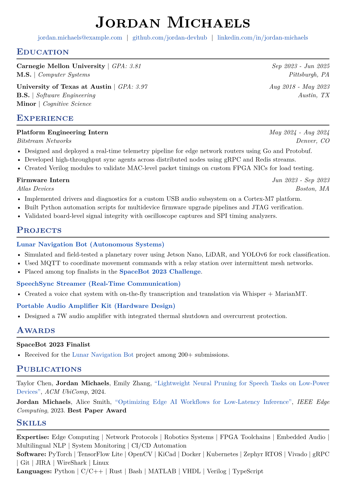
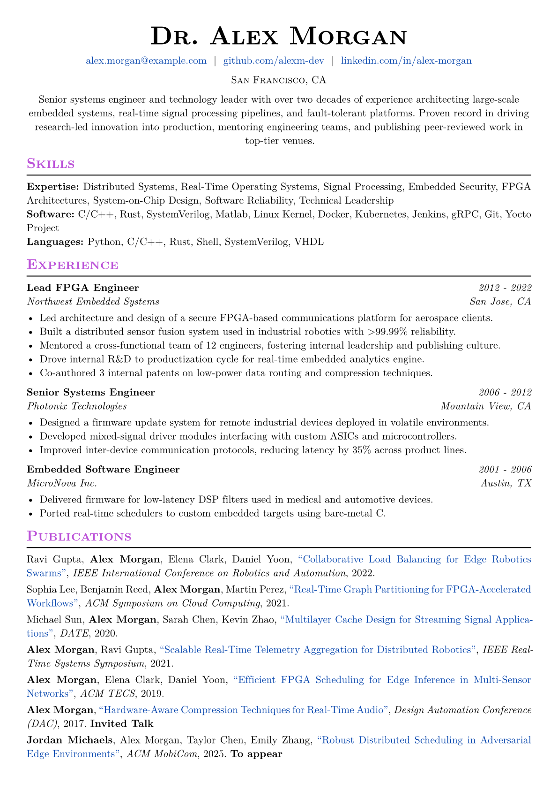
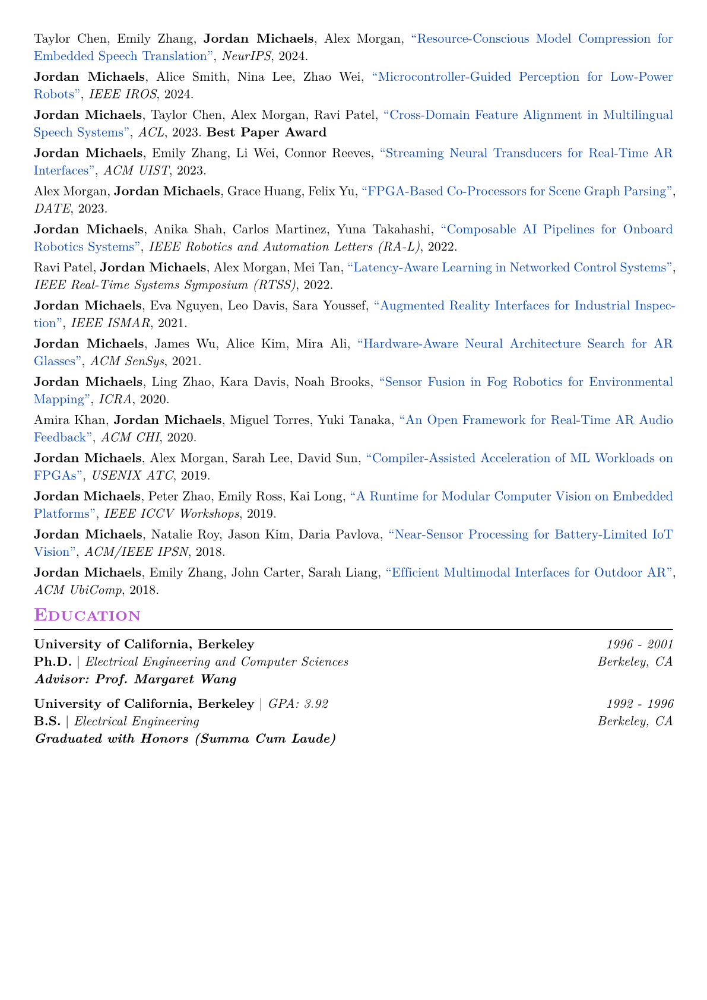

<div align="center">

# clickworthy-resume

**A simple, flexible, responsive, ATS-friendly, and click-worthy resume.**
</div>

## 🙋‍♂️ Introduction
This **Typst** Resume template allows for writing resumes and CVs fast. The core is borrowed from the [**guided-resume-starter-cgc**](https://github.com/typst/packages/tree/main/packages/preview/guided-resume-starter-cgc/2.0.0) template with extra features, more flexiblity, and formatting improvements.

For advice on writing an effective resume, this [small write-up](https://github.com/typst/packages/blob/main/packages/preview/guided-resume-starter-cgc/2.0.0/template/starter.typ) by the [**guided-resume-starter-cgc**](https://github.com/typst/packages/tree/main/packages/preview/guided-resume-starter-cgc/2.0.0) template author is quite helpful.

## 🏃 Getting Started
### [**Typst Web App**](https://typst.app/)
> **NOTE**: Instructions will be added on how to use the template with the **Typst Web App** once the package is available on the [**Typst Universe**](https://typst.app/universe/search/?kind=packages)

### **Local**
1. [Install Typst](https://github.com/typst/typst?tab=readme-ov-file#installation)
2. [Clone this repository](https://github.com/AbdullahHendy/clickworthy-resume)
3. Run `make install` to install the package locally.
4. Create a workspace in the location of choice and run `typst init @local/clickworthy-resume:0.1.0` to create a template. 
5. Edit the template and run `typst compile main.typ` **to generate a pdf resume** or see the [**Typst** guide](https://github.com/typst/typst?tab=readme-ov-file#usage) for more options. 
> **NOTE**: Steps 2 and 3 will not be necessary once the package is on the [**Typst Universe**](https://typst.app/universe/search/?kind=packages)

## ✏️ How to Edit
The provided template shows all functions that the package supports with their respective parameters, the following ***documentation*** is provided for completeness.

**All function parameters are technically optional for better customization**

**Most functions provide a `hide` flag to make a clean `*.typ` file including all information in one place without having to comment-out unwanted entries for a specific resume version**

### Resume headers and Configs
The resume is generated using a customizable `resume` function that accepts various parameters for layout, theme, and content. It defines the document’s formatting, header, and professional summary section, followed by the main content body.

#### Parameters
- `author`: Your full name
- `location`: City, state/province, and country
- `contacts`: A list of links or contact info
- `summary`: A short professional summary
- `theme-color`: Accent color for headings (default: `#26428b`)
- `font`: Font family used throughout the resume (default: `"New Computer Modern"`)
- `font-size`: Base font size (default: `11pt`)
- `lang`: Document language (default: `"en"`)
- `margin`: Page margins (default: `(top: 1cm, bottom: 0cm, left: 1cm, right: 1cm)`)

#### Example
```typ
#show: resume.with(
  author: "Dr. Alex Morgan",
  location: "San Francisco, CA",
  contacts: (
  [#link("mailto:alex.morgan@example.com")[#"alex.morgan@example.com"]],
  [#link("https://github.com/alexm-dev")[#"github.com/alexm-dev"]],
  [#link("https://linkedin.com/in/alex-morgan")[#"linkedin.com/in/alex-morgan"]],
  ),
  summary: "Senior systems engineer with 20+ years of experience in embedded systems, real-time pipelines, and fault-tolerant platforms. Proven leader in innovation, mentorship, and research-to-production delivery.",
  theme-color: rgb("#cc0000"),
  font: "New Computer Modern",
  font-size: 11pt,
  lang: "en",
  margin: (
    top: 1cm,
    bottom: 0cm,
    left: 1cm,
    right: 1cm,
  ),
)
```

---

### Education
The `edu` function formats a single educational entry, including institution name, degrees, GPA, and additional notes. You can list multiple degrees per institution, and control visibility with the `hide` flag.

#### Parameters
- `institution`: The name of the school or university
- `date`: The graduation date or duration
- `degrees`: A list of degree-level and field tuples, e.g. `("BSc", "Computer Science")`
- `gpa`: GPA string
- `location`: City/state/country of institution
- `extra`: Any extra info (e.g. "Thesis with distinction")
- `hide`: Boolean flag to skip rendering this entry (default: `false`)

#### Example
```typ
#show: edu(
  institution: "University of California, Berkeley",
  date: "2011–2015",
  degrees: (
    ("BSc", "Electrical Engineering & Computer Science"),
    ("Minor", "Philosophy"),
  ),
  gpa: "3.92",
  location: "Berkeley, CA",
  extra: "Thesis with distinction",
  hide: false,
)
```

---

### Experience
The `exp` function formats a professional experience entry, showing the role title, organization, date, location, and descriptive bullet points or details. You can control visibility using the `hide` flag.

#### Parameters
- `title`: Job title or role
- `organization`: Company or institution name
- `date`: Time period for the role
- `location`: Location of the job
- `details`: A block or list of content to describe your work
- `hide`: Boolean flag to skip rendering this entry (default: `false`)

#### Example
```typ
#exp(
  title: "Embedded Software Engineer",
  organization: "MicroNova Inc.",
  date: "2001 - 2006",
  location: "Austin, TX",
  details: [
    - Delivered firmware for low-latency DSP filters used in medical and automotive devices.
    - Ported real-time schedulers to custom embedded targets using bare-metal C.
  ],
  hide: true,
)
```

---

### Publication
The `pub` function formats a publication citation using various academic styles (e.g. APA, IEEE, MLA, CV). It supports highlighting a specific author, linking the title via DOI, and adding extra notes. Use the `hide` flag to skip rendering.
> **NOTE**: *CV* format is the default and appears to be the most widely used format. Other citation styles **might not** reflect all guidlines for that style in different scenarios. The styling in all styles are geared towards **Conference Papers**

#### Parameters
- `authors`: A list of author names
- `bold-author`: One name to emphasize in bold
- `title`: Title of the publication
- `venue`: Conference, journal, or publisher name
- `year`: Year of publication
- `doi-link`: DOI string without the https:// prefix (e.g. `"doi.org/..."`)
- `style`: Citation style (`"cv"`, `"apa"`, `"ieee"`, `"mla"`) (default: `"cv"`)
- `extra`: Any additional note or status (e.g. "Best Paper Award")
- `hide`: Boolean flag to skip rendering this entry (default: `false`)

#### Example
```typ
#pub(
  authors: (
    "Alex Morgan",
    "Jordan Michaels",
    "Taylor Chen",
  ),
  bold-author: "Jordan Michaels",
  title: "Cross-Domain Feature Alignment in Multilingual Speech Systems",
  venue: "ACL",
  year: "2023",
  doi-link: "doi.org/10.18653/v1/2023.acl-long.123",
  extra: "Best Paper Award",
  style: "cv",
  hide: false,
)
```

---

### Skills
The `skills` function displays categorized lists of skills or technologies. Each entry consists of a label (e.g. "Expertise", "Software") and a list of items shown inline and separated by commas. Each category is rendered on its own line.

#### Parameters
- `areas`: A list of tuples, each containing:
    - a category label (e.g. "Languages", "Tools")
    - a list of individual skills (each as a string or inline element)

#### Example
```typ
#show: skills((
  ("Expertise", (
    [Distributed Systems],
    [Embedded Security],
    [FPGA Architectures],
    [Technical Leadership],
  )),
  ("Software", (
    [C/C++],
    [Rust],
    [SystemVerilog],
    [Docker],
    [Git],
  )),
  ("Languages", (
    [Python],
    [C/C++],
    [Rust],
    [Shell],
  )),
))
```

---

### Multi-page Support
For CVs with more than one page, use `#pagebreak()` where apropriate for page-splitting if the value for `bottom` in the `margin` field in [#show: resume.with()](#resume-headers-and-configs) is too small to make a clean split between items.

#### Example
```typ
#pub(
  authors: (
    "Jordan Michaels",
    "Alex Morgan",
    "Taylor Chen",
    "Emily Zhang",
  ),
  bold-author: "Jordan Michaels",
  title: "Robust Distributed Scheduling in Adversarial Edge Environments",
  venue: "ACM MobiCom",
  year: "2025",
  doi-link: "doi.org/10.1145/9999999.9999999",
  extra: "To appear",
  style: "cv",
)

// Page break for readability
#pagebreak()

#pub(
  authors: (
    "Taylor Chen",
    "Emily Zhang",
    "Jordan Michaels",
    "Alex Morgan",
  ),
  bold-author: "Jordan Michaels",
  title: "Resource-Conscious Model Compression for Embedded Speech Translation",
  venue: "NeurIPS",
  year: "2024",
  doi-link: "doi.org/10.48550/arXiv.2406.00123",
  style: "cv",
)
```

## 📝 Example Resume
  <a href="./examples/resume-sample.png" target="_blank">
    <picture>
      <source media="(prefers-color-scheme: dark)" srcset="./examples/resume-sample.png">
      
    </picture>
  </a>

## 📓 Example CV

<div align="center">
<table>
  <tr>
    <td>
      <a href="./examples/cv-sample-p1.png" target="_blank">
        <picture>
          <source media="(prefers-color-scheme: dark)" srcset="./examples/cv-sample-p1.png">
          
        </picture>
      </a>
    </td>
    <td>
      <a href="./examples/cv-sample-p2.png" target="_blank">
        <picture>
          <source media="(prefers-color-scheme: dark)" srcset="./examples/cv-sample-p2.png">
          
        </picture>
      </a>
    </td>
  </tr>
</table>
</div>

## 👨🏻‍💻 Development & Contribution
**TODO**


## 📋 TODO
**TODO**
